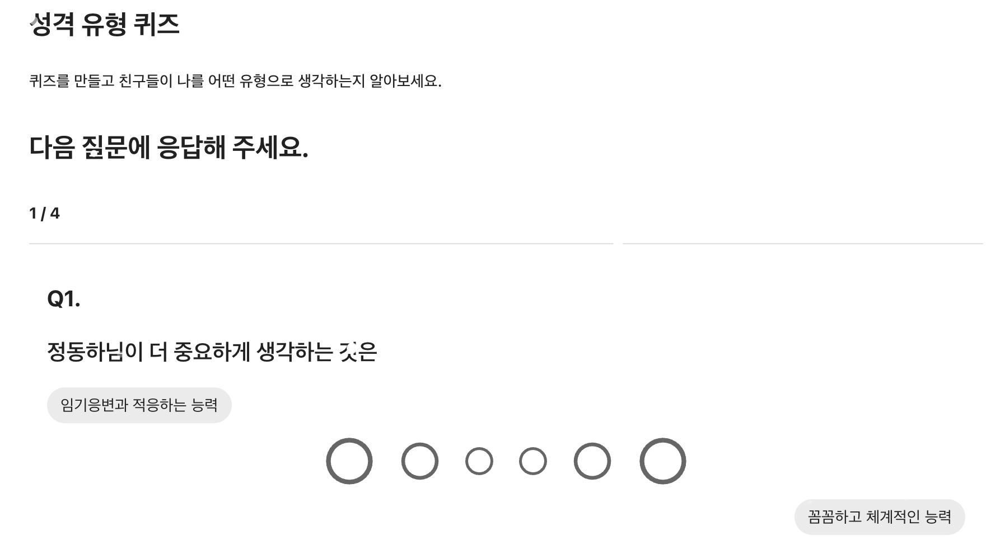
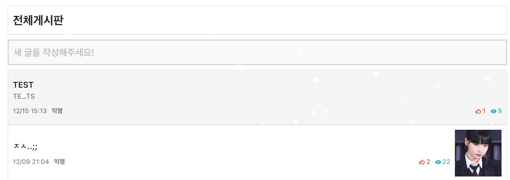
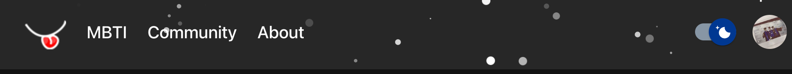

# [MBTIWithUs](https://www.mbtiwithus.com)

<p align="center">
    <a href="https://www.mbtiwithus.com">
        
    </a>
    <h3 align="center">
        <a href="https://www.mbtiwithus.com">Visit the live app</a>
    </h3>
    
</p>
<p align="center">
    <a href="https://github.com/MBTIWithUs/MBTIWithUs-FE/issues"></a>
    <a href="https://github.com/MBTIWithUs/MBTIWithUs-FE/blob/master/LICENSE">
    
    </a>
    
    
    
</p>

## 🗂 Contents

- [Features](#-features)
- [About](#-about)
- [Install](#-install)
- [Author](#-author)
- [Acknowledgements](#-acknowledgements)
- [Contributing](#-contributing)
- [License](#-license)

## 🎉 Features

- **MBTI 검사**
  
  <br/><br/>

  - 총 24개의 질문 문항을 서버에서 받아 이를 6개씩 pagination으로 표시했습니다.
  - 고민했던 것은 "radio button을 눌렀을 때 재미를 느낄 수 있을까"였습니다.

  <br/>

- **커뮤니티**
  <br/><br/>

  - 디자인은 심플하고 매력적인 everytime 게시판에서 가져왔습니다.
    - 무한 스크롤링을 구현하고 서버측으로 쓸모 없는 요청이 없도록 고민했습니다.

  <br/>

- **다크 모드**
  <br/><br/>

  - 페이지를 작성할 때마다 색조합에 대해 고민하면서 component에 색을 적용할 때 특정 색 값이 아닌 전역으로 쓰이는 색을 사용하도록 했습니다.

  <br/>

- **반응형 웹**<br/>
  <br/><br/>

  - 페이지를 작성할 때마다 유저의 화면을 고려하면서 component 위치 구성에 대해 생각했습니다.

## 📖 About

<br/>
<aside>
💡 <b> 자가 보고형 심리검사뿐 아니라 타인의 결과 반영 및 확인할 수 있는 서비스 </b>
</aside>
<br/>

## 🚘 Install

Clone and install.

```
git clone https://github.com/MBTIWithUs/MBTIWithUs-FE.git
cd MBTIWithUs-FE
yarn
```

Run a development server.

```
yarn start
```

## 😀 Author

- [정동하](https://github.com/ha4219)

## ✅ Acknowledgements

- 서버 개발을 해준 [태욱](https://github.com/umtuk)아 고맙다!

## 🌋 Contributing

- I will not be accepting PR's on this repository. Feel free to fork and maintain your own version.

## 📄 License

- This project is open source and available under the [MIT License](LICENSE).
